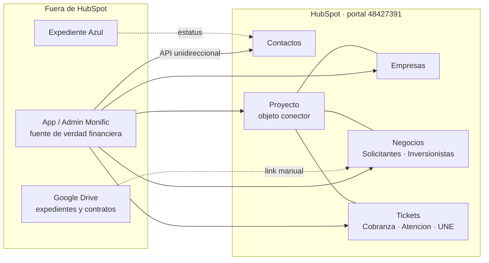

# Mapa General

> **En una frase:** el punto de entrada a toda la wiki — de aquí sales a cualquier parte del proyecto BOOST.

Si es tu primera vez, lee [[Resumen Ejecutivo]] antes que nada.

---

## El proyecto en una imagen



Detalle en [[Modelo de Datos HubSpot]] y [[Integracion Admin Monific HubSpot]].

---

## Navegación por tema

### 🏢 Quién es el cliente
- [[Monific]] — la empresa, qué hace, cómo gana dinero
- [[Modelo de Negocio]] — las dos verticales y el ciclo del dinero
- [[Buyer Persona Inversionista]] · [[Buyer Persona Solicitante]]
- [[Marco Regulatorio]] — CNBV, Ley Fintech, UNE
- [[Stack Tecnologico Monific]] — qué herramientas usa y cuáles se sustituyen

### 📋 El proyecto
- [[Proyecto BOOST]] — objetivo, fases, entregables
- [[Contrato y Alcance]] — qué se firmó exactamente
- [[Metodologia BOOST]] — Learn · Do · Teach · Repeat
- [[Cronologia del Proyecto]] — línea de tiempo completa
- [[Plan de Cierre y Gantt]] — el plan vigente
- [[Gobernanza y Rituales]] — cómo se trabaja el día a día
- [[Economia del Proyecto]] — fees, horas, cotizaciones extra
- [[Conflicto Contractual]] ⚠️ — la disputa abierta desde 2026-06-18

### 👥 Personas
- [[Directorio de Contactos]] — nombres, cargos, correos
- [[Equipo Monific]] · [[Equipo Black and Orange]]
- [[Roles Operativos]] — A.A.S., A.A.I., E.A.C., D.C., D.C.L., ARI

### ⚙️ Los procesos
- [[Proceso Comercial Solicitantes]] — de formulario a campaña publicada
- [[Proceso Comercial Inversionistas]] — de registro a inversionista activo
- [[Proceso de Cobranza]] — de inversión efectiva a liquidación o ejecución
- [[Proceso de Servicio ATC]] — tickets de atención
- [[Proceso UNE]] — reclamaciones formales reguladas
- [[SLAs y Escalamientos]] — tiempos y quién empuja a quién
- [[Matriz de Comunicaciones]] — las 81 comunicaciones objetivo

### 🔧 Lo construido en HubSpot
- [[Portal HubSpot]] — licencias, límites, accesos
- [[Modelo de Datos HubSpot]] — objetos y asociaciones
- [[Pipelines]] — etapas de cada pipeline
- [[Workflows]] — tablero WF-001 a WF-064 + UNE-01 a UNE-06
- [[Propiedades]] — el catálogo y la brecha real
- [[Dashboards y Reportes]]
- [[Higiene y Accesos]] — apps privadas, scopes, limpieza

### 🔌 La integración
- [[Integracion Admin Monific HubSpot]] — arquitectura y decisiones
- [[Reglas de Negocio API]] — las 30 reglas del contrato técnico
- [[Diccionario de Propiedades API]] — mapeo campo a campo
- [[Sistemas Externos]] — STP, Expediente Azul, WhatsApp, CallPicker, Singular, Moonflow

### 📊 Dónde estamos
- [[Estado Actual]] — la foto al corte más reciente
- [[Auditorias]] — las cuatro auditorías y sus cifras
- [[Analisis de Cierre BNO]] ⭐ — la lectura de B&O: de los 29 rojos, ~10 son defectos propios
- [[Bloques de Cierre B01-B16]] — el plan de remediación exigido
- [[Pendientes Criticos]]
- [[Riesgos]]
- [[Contradicciones y Verificaciones]] ⚠️ — datos que no cuadran entre fuentes
- [[Preguntas Abiertas]]

### 📚 Fuentes
- [[Indice de Fuentes]] — mapa ID ↔ documento original
- [[Correspondencia]] ⭐ — los 100 correos del proyecto (oct-2025 → jun-2026)
- [[Minutas]] — las 21 minutas y sus decisiones
- [[Masters de Implementacion]]
- [[Documentos Contractuales]]

---

## Consultas Dataview

> Requiere el plugin **Dataview** activado. Si no lo tienes, verás el bloque de código en crudo.

### Páginas en riesgo o bloqueadas

```dataview
TABLE area AS "Área", estado AS "Estado", confianza AS "Confianza", actualizado AS "Actualizado"
FROM "Wiki Monific"
WHERE estado = "en-riesgo" OR estado = "bloqueado"
SORT estado ASC, actualizado DESC
```

### Páginas de baja confianza (revisar contra fuente)

```dataview
TABLE area AS "Área", tipo AS "Tipo", fuentes AS "Fuentes"
FROM "Wiki Monific"
WHERE confianza = "baja"
SORT area ASC
```

### Lo más rancio (candidato a actualizar)

```dataview
TABLE actualizado AS "Actualizado", estado AS "Estado"
FROM "Wiki Monific"
WHERE tipo != "indice"
SORT actualizado ASC
LIMIT 15
```

### Todo por área

```dataview
TABLE rows.file.link AS "Páginas"
FROM "Wiki Monific"
WHERE tipo != "indice"
GROUP BY area
```

---

## Relacionado

- [[index]] — catálogo plano de todas las páginas
- [[Resumen Ejecutivo]] — la versión de 5 minutos

## Fuentes

Página de navegación; no aporta afirmaciones propias. Las fuentes viven en cada página enlazada.
