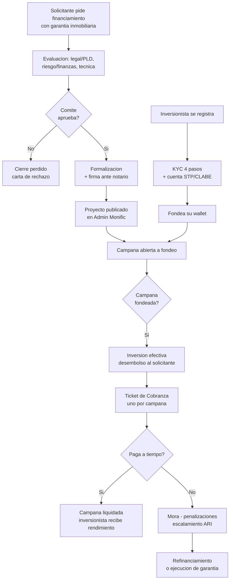

# Modelo de Negocio

> **En una frase:** Monific fondea proyectos inmobiliarios con dinero de inversionistas minoristas y cobra al solicitante durante el plazo; el ciclo completo va de la solicitud a la liquidación o a la ejecución de la garantía.

---

## El ciclo completo



---

## Lado solicitante — de dónde sale el proyecto

| Paso | Qué pasa | Dónde vive |
|---|---|---|
| Solicitud | Formulario web. Pregunta clave: *¿cuentas con un inmueble que pueda quedar en garantía?* | 🔴 Hoy Google Forms; debe ser formulario HubSpot embebido |
| Viabilidad | **Con garantía = Viable. Sin garantía = No viable.** *Parcialmente viable* es decisión manual del asesor. Sin scoring numérico. ✅ Decisión cerrada 2026-07-27 | HubSpot |
| Expediente | El solicitante sube documentos a una carpeta de Drive creada por el A.A.S. | Google Drive + [[Sistemas Externos]] (Expediente Azul) |
| Evaluación | Legal/PLD, Riesgo/Finanzas y Técnica. La decisión del comité es manual, con fecha, motivo y evidencia | HubSpot |
| Formalización y firma | Contrato ante notario. SLA habitual de 15 días hábiles | Drive |
| Publicación | El Admin Monific publica la campaña. **El Negocio solo pasa a Ganado cuando contrato firmado = Sí Y Admin confirma campaña publicada** | Admin Monific |

Detalle en [[Proceso Comercial Solicitantes]].

### Criterio de viabilidad (regla cerrada)

| Respuesta | Resultado |
|---|---|
| Tiene inmueble para garantía | **Viable** — pasa al flujo |
| No tiene inmueble | **No viable** — se le informa la alternativa de inversión, pero **no** se crea Negocio de Inversionista hasta que la persona exprese interés |
| Caso intermedio | **Parcialmente viable** — el asesor decide tras revisar avalúo, monto solicitado y capacidad de pago |

Regla práctica que dio Raquel Alfie: inmueble de hasta $60 MDP, y se puede pedir hasta la mitad de su valor.

---

## Lado inversionista — de dónde sale el dinero

| Nivel | Estado | Qué significa |
|---|---|---|
| **1** | Registro / KYC inicial | Identidad validada (CURP) y datos personales |
| **2** | Dirección | Domicilio completo, residente en México |
| **3** | Cuenta STP activa | CLABE generada — listo para fondear |
| **4** | Inversionista activo | **Primera compra confirmada** |

La propiedad canónica es `nivel_registro`. El nivel **solo sube, nunca retrocede**. Nivel 4 se envía una sola vez.

Detalle en [[Proceso Comercial Inversionistas]] y [[Buyer Persona Inversionista]].

### Tipos de movimiento

| `move_type` | Qué es |
|---|---|
| `PURCHASE` | Compra de participaciones (primario o secundario) |
| `SOLD` | Venta en mercado secundario |
| `LIQUIDATION` | Distribución de rendimientos o cierre de campaña |

Cada movimiento es un registro separado identificado por `move_id`. → [[Reglas de Negocio API]]

---

## Proyecto y campaña — la relación que hay que entender

```
Proyecto (objeto HubSpot, llave: numero_de_proyecto)
 ├── Campaña FIN-001 ──► Ticket de Cobranza
 ├── Campaña FIN-002 ──► Ticket de Cobranza
 └── Campaña REFIN-001 ─► Ticket de Cobranza (nace de un refinanciamiento)
```

- Un proyecto aprobado puede dividirse en varias campañas (ej. $10 MDP en 3 campañas).
- **Cada campaña fondeada genera su propio Ticket de Cobranza.**
- Un refinanciamiento **no** ajusta el ticket existente: cierra el viejo y nace uno nuevo.
- ❌ **No existe un "Deal padre de campaña".** El conector es el objeto Proyecto.

---

## Tipos de rendimiento

| | Rendimiento Fijo (RF) | Rendimiento Variable (RV) |
|---|---|---|
| Calendario | Fechas y montos definidos | Sin monto fijo |
| Cobranza | Recordatorio con monto exacto | Recordatorio + solicitud de reporte de ingresos |
| Propiedades aplicables | Tabla de cuotas, plazo, monto total, número de cuotas | Solo las generales |

---

## Clasificación de riesgo del proyecto

| Tipo | Definición | Consecuencia en mora |
|---|---|---|
| **Solid** | Aforo ≥ 1.5 : 1 **y** garantía real | Comisión por pago tardío 15 % + IVA e interés moratorio, **automáticos** desde el día 1 |
| **Estándar (Legacy)** | Primeros proyectos de Monific, garantías menos robustas | Gestión de cobranza estándar |

🔴 **Dos datos en disputa — no configurar nada sin resolverlos:**

| Dato | `D195` (diseño con IA) | Instrucción directa de dirección |
|---|---|---|
| **Interés moratorio** | 38 % anual, solo para proyectos Solid | **Vianey Correa, Dir. Finanzas (2026-03-05):** *"para todos los casos **sin excepción y sin casos especiales** es **dos veces la tasa ordinaria**"* |
| **Aforo de respaldo** | ≥ **1.5 : 1** | **Karen Gómez y Raquel (2026-04-17):** el activo debe respaldar el monto *"idealmente **2:1**"* |

Prevalece la instrucción de dirección, pero ambas deben confirmarse contra el contrato de financiamiento real. → [[Contradicciones y Verificaciones]] C-21 y C-22

---

## Objetivos de negocio declarados (KPIs)

Del brief del cliente. ⚠️ Son metas aspiracionales, no líneas base medidas:

| Objetivo | Meta |
|---|---|
| Conversión cuenta activa → inversión | ≥ 35 % |
| Conversión lead solicitante → fondeo | ≥ 25 % |
| Tiempo medio de primera respuesta | < 10 min |
| Reinversión en campañas nuevas | ≥ 70 % |
| Pagos puntuales de solicitantes | ≥ 90 % |
| Contactos de marketing activos | ≤ 7,000 |
| CAC por inversión efectiva | ≤ $250 MXN |
| ROI de campañas | ≥ 4× |

---

## Relacionado

- [[Monific]] · [[Marco Regulatorio]]
- [[Proceso Comercial Solicitantes]] · [[Proceso Comercial Inversionistas]] · [[Proceso de Cobranza]]
- [[Modelo de Datos HubSpot]] — cómo se representa esto en el CRM

## Fuentes

- `D193` — Brief de Necesidades
- `D195` — Entregables pendientes del 26 de enero (formulario, flujo de cobranza, SLAs)
- `X011` — Master de Implementación Cobranza
- `X018` — Documento API de Integración Unificado
- `D167` — Maestro Operativo (2026-07-31)
- `D180` — Minuta 2026-07-27 (criterio de viabilidad)
