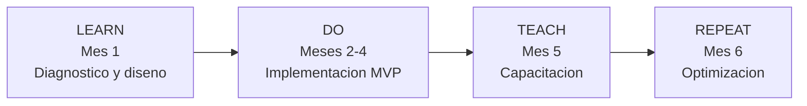

# Metodología BOOST

> **En una frase:** el método de Black & Orange en cuatro fases —Learn, Do, Teach, Repeat— y en qué punto real está cada una.

---

## Las cuatro fases

### LEARN — Diagnóstico y diseño del proceso (Mes 1)

| Actividad | Entregable |
|---|---|
| Auditoría del ecosistema actual | Diagnóstico de HubSpot, integraciones y estructura de datos |
| Mapeo **AS-IS** y diseño **TO-BE** | Documentación de procesos de inversión, solicitud y cobranza en un modelo unificado |

Incluye el **Add-On de Mapeo de Procesos Elite** ($47,250 MXN), que produce los masters de implementación y los flujogramas.

**Estado real:** 🟡 Los masters y flujogramas existen, pero el requerimiento exige su corrección y conciliación con el estado real de HubSpot (bloque **B01**). Además, dos masters contenían plantilla de otro cliente (bloque **B12**) 🔴.

### DO — Implementación del MVP (Meses 2, 3 y 4)

| Actividad | Entregable |
|---|---|
| Configuración de plataforma | Pipelines comerciales, tickets de cobranza, workflows, dashboards, conexiones API |
| Automatización de procesos críticos | Onboarding, KYC, recordatorios de pago, reactivación |

**Estado real:** 🔴 Los pipelines y workflows existen pero no están verificados. Los dashboards son bloque **B06** pendiente. La integración se replanteó y arrancó en agosto de 2026.

### TEACH — Capacitación y acompañamiento (Mes 5)

| Actividad | Entregable |
|---|---|
| Transferencia de conocimiento | Sesiones prácticas a marketing, operaciones y cobranza |
| Base de conocimiento interna | Videos, manuales operativos, guías rápidas |

**Estado real:** 🔴 Bloque **B09** del requerimiento: *"Entregar manuales, guías y videos; completar programa correctivo o equivalente"*. Se registran dos sesiones de Capacitación de Ventas (2026-06-04 y 2026-06-05). El programa de seis sesiones acordado en la propuesta técnica no está acreditado como concluido.

### REPEAT — Optimización continua (Mes 6)

| Actividad | Entregable |
|---|---|
| Mejora iterativa | Ajustes finos a flujos, automatizaciones y dashboards a partir del feedback |

**Estado real:** 🔴 No alcanzado. El mes 6 se consumió en remediación.

---

## Cómo se desvió del plan

| Plan original (kickoff 2026-01-07) | Realidad |
|---|---|
| Ene–feb: mapeo de procesos | ✅ Se cumplió — sesiones martes 14:00 y jueves 16:00 |
| Mar–abr: implementación | 🟡 Se configuró, pero sin verificación ni integración |
| May–jun: capacitaciones | 🔴 Sustituido por auditorías, hallazgos y requerimiento formal |
| Jul–ago | Remediación y arranque real de la integración |

Causas de la desviación registradas en las minutas:

1. **Falta de documentación de la API del Admin Monific** — bloqueó la integración durante meses (`D148`, 2026-05-22: se estimaron 12 semanas adicionales y una desviación de 3–4 semanas).
2. **Cambio del modelo de integración a asesoría técnica** (`D133`, 2026-06-08): B&O dejó de intentar integrar directamente y pasó a dar orientación técnica sin manipular el código, porque el código fuente y sus accesos estaban del lado de Monific.
3. **Auditorías del cliente** (mayo–junio) que destaparon 284 hallazgos.
4. **Salida de [[Caroline Bersot]]** de la cuenta hacia junio de 2026, con transición no formalizada según Monific.

→ [[Cronologia del Proyecto]] · [[Conflicto Contractual]]

---

## La secuencia de mapeo que se acordó

En el kickoff se debatió si mapear **por módulo** (ventas → cobranza → servicio) o **por perfil completo** (todo el ciclo del solicitante, luego todo el del inversionista).

- Ricardo Gómez y Caroline Bersot propusieron por módulo.
- Eduardo Solís propuso por perfil completo, porque el proceso quedaría incompleto de otra forma.
- **Se acordó dejar preestablecido empezar por ventas**, revisando primero la documentación de Raquel.

En la práctica el orden fue: Ventas (feb) → Cobranza (mar) → Servicio/UNE (mar) → Integración (may–ago).

---

## Relacionado

- [[Proyecto BOOST]] — el alcance
- [[Cronologia del Proyecto]] — la línea de tiempo detallada
- [[Bloques de Cierre B01-B16]] — cómo se está remediando cada fase
- [[Plan de Cierre y Gantt]]

## Fuentes

- `P_ANEXO` — Anexo A · Plan BOOST, sección "Fases y Actividades"
- `D149` — Sesión de Kickoff (2026-01-07)
- `D148` — Minuta Cotización extra (2026-05-22)
- `D133` — Alineación interna horas consultoría (2026-06-08)
- `X020` — Requerimiento Formal, bloques B01, B06, B09, B12
