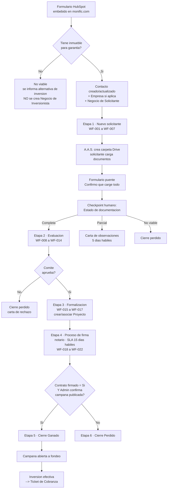

# Proceso Comercial Solicitantes

> **En una frase:** del formulario web a la campaña publicada — el ciclo por el que un solicitante pasa de lead a proyecto fondeable.

**Objeto HubSpot:** Negocio · **Pipeline:** Solicitantes · **Workflows:** WF-001 a WF-024

**Flujograma TO-BE (V2, 2026-09-01):** `miro.com/app/board/uXjVHsUR1nE=` — tablero en la cuenta de
Miro de B&O, construido desde el V1 del cliente (`miro.com/app/board/uXjVG7nRR_I=`, feb-2026) más las
decisiones canónicas de esta página. El V1 queda como histórico; propuesta pendiente de validación
de Monific.

🔴 **Estatus del recorrido completo: no verificado.** Ningún tramo debe mostrarse en verde hasta pasar casos por segmento y una prueba de punta a punta desde formulario hasta cobranza (`D167`).

---

## Flujo completo



---

## Las etapas del pipeline

| # | Etapa | Objetivo | Responsable |
|---|---|---|---|
| 1 | **Nuevo solicitante** | Acompañar la carga de documentos hasta completar expediente y confirmar requisitos mínimos | Sistema (auto) · soporte A.A.S. |
| 2 | **Evaluación** | Evaluación técnica, jurídica y financiera + decisión formal del Comité documentada | A.A.S. · soporte Legal/PLD, Riesgo/Finanzas, Técnica |
| 3 | **Formalización** | Formalizar el proyecto aprobado y armar la campaña | A.A.S. · soporte Marketing |
| 4 | **Proceso de firma** | Acto notarial que convierte la aprobación en garantía jurídica. SLA habitual: **15 días hábiles** | E.E.J. |
| 5 | **Cierre Ganado** | Campaña publicada en Admin Monific y proyecto disponible para fondeo | Sistema |
| 6 | **Cierre Perdido** | Cierre negativo con motivo específico y comunicación institucional | Sistema (casos típicos) · A.A.S. (especiales) |

---

## La regla de viabilidad (decisión cerrada 2026-07-27)

| Condición | Resultado |
|---|---|
| Tiene inmueble que puede quedar en garantía | ✅ **Viable** |
| No tiene inmueble | ❌ **No viable** |
| Caso intermedio | 🟡 **Parcialmente viable** — decisión **manual** del asesor tras revisar avalúo, monto solicitado y capacidad de pago |

**No se usa scoring numérico.** El brief original lo pedía; se descartó para el MVP.

🔴 **Contradicción abierta:** el master de Solicitantes todavía tiene una propiedad **"Ruta de Scoring"** con valores `A: ≥70 puntos / B: 40–69 / C: ≤39`, y varios motivos de cierre perdido dicen "Score A: …". Esa lógica quedó obsoleta. → [[Contradicciones y Verificaciones]]

**Regla adicional:** sin garantía se informa la alternativa de inversión, pero **no se crea un Negocio de Inversionista** hasta que la persona exprese interés explícito.

---

## El formulario y el árbol de decisiones

🔴 El formulario definitivo de HubSpot **no está acreditado**. Hoy sigue vivo un Google Form. Los workflows `1640673709`, `1832556831` y `1834467729` no demuestran el recorrido completo de alta.

Contenido y árbol de decisiones completos en [[Buyer Persona Solicitante]].

**Comportamiento esperado del envío:** crear o actualizar Contacto → evitar duplicados → asociar Empresa si aplica → evaluar garantía → crear Negocio solo cuando procede → asignar responsable → enviar la comunicación aprobada.

---

## Los workflows

| Rango | Cubre | Estado al 2026-07-31 |
|---|---|---|
| **WF-001 – WF-007** | Expediente y seguimiento | 🟡 5 pendientes · 🔴 3 con error (WF-003, WF-004, WF-007) |
| **WF-008 – WF-014** | Evaluación y comité | 🟡 5 pendientes · 🔴 2 con error (WF-010, WF-011) |
| **WF-015 – WF-024** | Formalización, firma y cierre | 🟡 8 pendientes · 🔴 2 con error (WF-020, WF-021) |

Tablero completo en [[Workflows]].

**Reglas de seguimiento definidas:** el acompañamiento debe cubrir **2, 3, 7 y 15 días** y escalar tareas vencidas. Al día 15 se pasa a pausa/seguimiento. El cierre perdido exige decisión manual y motivo.

### Los bugs críticos conocidos

| Hallazgo | Workflow | Problema |
|---|---|---|
| **CON-021** 🔴 | WF-008 | Reinscripción apagada. Si el comité aprueba **después** de entrar a Evaluación (el caso normal), el workflow nunca dispara y el negocio se queda atorado. Rompe el cruce Evaluación → Formalización |
| **CON-026** 🔴 | WF-010 | La notificación al DG se envía a **todos los contactos asociados** al negocio, incluido el solicitante. Filtración de comunicación interna al cliente |
| **CON-037** 🔴 | WF-014 | El master dice "Encendido", HubSpot lo tiene **desactivado**. Las solicitudes rechazadas no generan tarea de carta de rechazo |
| **CON-061** 🔴 | WF-027 | Valores *hardcoded*: `Nivel de registro = "3. Cuenta STP creada"` y `CLABE STP = 1`. Si se activa, todos los negocios reciben los mismos valores fijos |

---

## Propiedades por etapa

Extracto del master (`X012`). ⚠️ Son **nombres en CRM**, no nombres internos: el diccionario técnico está pendiente (gate T1).

**Nuevo solicitante:** Tipo de cliente · Canal de entrada · Fuente de lead · Viabilidad inicial · ~~Ruta de Scoring~~ 🔴 · Estatus de documentación · Fecha de creación de negocio · Link de carpeta en Drive · Tipo de inmueble en garantía · Zona de inmueble · Monto solicitado · Destino del financiamiento

**Evaluación:** Áreas de evaluación notificadas · Fecha de decisión de comité · Motivo de decisión · Evaluación de áreas · Decisión de comité · Plazo de financiamiento · Tasa anual fija · Tipo de instrumento · Garantía estructurada · Destino autorizado

**Formalización:** Material de campaña listo · Tipo de rendimiento (RF/RV) · Tipo de proyecto (Solid / Estándar Legacy) · Obligados solidarios · Estatus de formalización · Link material de campaña

**Proceso de firma:** Tipo de instrumento (Hipotecario / Fiduciaria / Cesión de derechos / Pagaré con aval) · Notario asignado · Folio inscripción a registro · Número de fideicomiso · Link del expediente · **Contrato firmado** · Fecha de firma · Link de contrato

**Cierre ganado:** Fecha de cierre ganado
**Cierre perdido:** Fecha de cierre perdido · Motivo documentado · Link carta de rechazo · Detalles del rechazo

→ [[Propiedades]]

---

## La brecha crítica: Proyecto y el gate doble

🔴 Regla que debe implementarse y **no está probada**:

1. En **Formalización** debe crearse o asociarse el objeto **Proyecto** usando `numero_de_proyecto`.
2. El Negocio solo pasa a **Ganado** cuando `contrato firmado = Sí` **Y** Admin confirma que la campaña fue publicada.

Los workflows actuales no acreditan ni el Proyecto ni el gate doble.

→ [[Modelo de Datos HubSpot]]

---

## La estructura de expediente en Drive

### Persona física

```
01. Proyecto
    01 Título de propiedad · 02 Certificado de libertad de gravamen · 03 Avalúo
    04 Boleta predial · 05 Boleta de agua · 06 Materiales gráficos · 07 Brochure
02. Persona física garante
    01 Identificación oficial · 02 CURP · 03 Certificado digital
    04 Constancia de situación fiscal · 05 Comprobante de domicilio
    06 Opinión de cumplimiento · 07 Estado de cuenta bancario
    99 Reporte historial crediticio · 99 Cuestionario persona física
03. Persona física obligado solidario
    (mismos documentos del garante)
```

### Persona moral

```
01. Proyecto  (igual que persona física)
02. Persona moral
    01 Acta constitutiva · 02 Asamblea más reciente · 03 Poder notarial
    04 Certificado digital · 05 Constancia de situación fiscal
    06 Comprobante de domicilio · 07 Opinión de cumplimiento
    08 Estado de cuenta bancario · 09 Organigrama
    99 Cuestionario persona moral
```

**Regla clave:** *HubSpot no lee Drive.* Drive solo guarda documentos; las decisiones se toman en HubSpot con propiedades. Por eso existe el **formulario puente** de confirmación de carga.

---

## Cartas institucionales

Tres familias de plantillas prellenables, ubicadas en Drive:

| Carpeta | Uso |
|---|---|
| `01 - Carta Solicitantes Aprobados` | Monto aprobado, tasa, plazo, tipo de instrumento, condiciones y pasos siguientes |
| `02 - Carta Solicitantes con Observaciones` | Bullets seleccionables: documentos faltantes, proyección no sustentada, garantía no estructurada, inconsistencias de titularidad, otros. Con fecha límite (default 5 días hábiles) |
| `03 - Cartas Solicitantes Rechazados` | Cuatro plantillas: documentación pendiente, proyección financiera no aprobada, requisitos de deuda y riesgo, valuación/aforo insuficiente |

Se guardan en `carta_observacion_link` y `carta_rechazo_link` para trazabilidad. 🔴 Bloque **B08**: son 4 de las 81 comunicaciones y ninguna está implementada.

---

## Relacionado

- [[Buyer Persona Solicitante]] — quién es y qué necesita
- [[Proceso de Cobranza]] — lo que ocurre después del fondeo
- [[SLAs y Escalamientos]] — tiempos de cada etapa
- [[Workflows]] · [[Pipelines]] · [[Propiedades]]
- [[Matriz de Comunicaciones]] — las 22 comunicaciones SOL

## Fuentes

- `D167` — Maestro Operativo (2026-07-31): recorrido real de Solicitantes y fichas WF-001 a WF-024
- `X012` — Master de Implementación Proceso Comercial
- `D195` — Entregables del 26 de enero: formulario, árbol de decisiones, SLAs, estructura de Drive, cartas
- `D180` — Minuta 2026-07-27: criterio de viabilidad
- `X020` — Requerimiento Formal: hallazgos CON-021, CON-026, CON-037, CON-061
