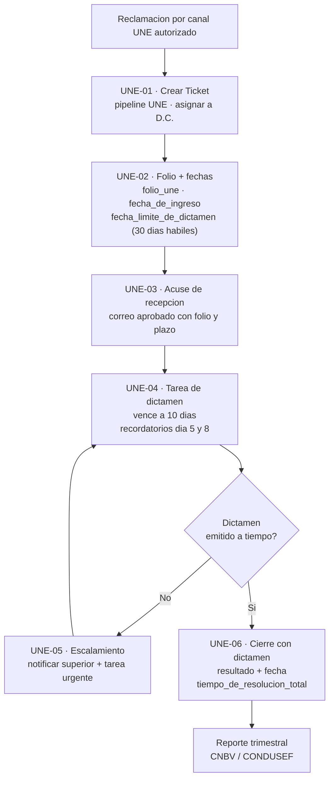

# Proceso UNE

> **En una frase:** el flujo regulatorio de reclamaciones formales ante la Unidad Especializada de Atención a Usuarios — obligatorio por CNBV y el único bloque del proyecto donde **ninguno** de sus seis flujos está acreditado en HubSpot.

**Objeto HubSpot:** Ticket · **Pipeline:** UNE · **Flujos:** UNE-01 a UNE-06

**Flujograma TO-BE (V2, 2026-09-01):** `miro.com/app/board/uXjVHr71yws=` — tablero en la cuenta de
Miro de B&O, compartido con [[Proceso de Servicio ATC]] (ATC arriba, UNE abajo, conectados por el
ticket Tipo E). Incluye marcado el pendiente de decisión del folio (Admin por API vs ID nativo).
Propuesta pendiente de validación de Monific.

🔴 **Estado: los seis flujos figuran como "No acreditado" en el inventario de HubSpot.** Bloque **B15** del requerimiento formal.

---

## Por qué importa más que el resto

Es el único proceso con **plazo regulatorio externo**. Monific responde ante CNBV/CONDUSEF con un reporte trimestral. Un incumplimiento aquí no es un problema de conversión: es un problema regulatorio.

El requerimiento formal lo dice explícitamente:

> *"El proyecto no se considera cerrado (…) mientras subsista el riesgo operativo y regulatorio asociado a los flujos de atención a usuarios, sujeto a validación de Legal y Compliance."*

→ [[Marco Regulatorio]]

---

## La regla de separación

> **Una reclamación formal UNE no debe mezclarse con el Ticket de servicio.** Genera un **Ticket separado**, con folio, fechas, tareas, dictamen y cierre regulatorio.
> **Nueva reclamación = Ticket nuevo.** No se reabre.

Un ticket de atención Tipo D (queja) puede convertirse en Tipo E (reclamación formal UNE) → genera un ticket propio en el pipeline UNE.

→ [[Proceso de Servicio ATC]]

---

## El pipeline

| Etapa | Objetivo | Responsable |
|---|---|---|
| **Abierto** | Registrar la reclamación, asignarla y gestionar el proceso regulatorio dentro del SLA de **30 días hábiles** exigido por CNBV/CONDUSEF | D.C. (Director Comercial) · soporte D.C.L. |
| **Cerrado** | Registrar el cierre con dictamen documentado y dejar el ticket disponible para el reporte trimestral | D.C. |

⚠️ El master asigna las reclamaciones UNE a **Raquel Alfie**.

---

## Los seis flujos

| ID | Flujo | Regla de diseño | Estado |
|---|---|---|---|
| **UNE-01** | Crear / registrar Ticket UNE | Crear Ticket en pipeline UNE desde formulario o correo aprobado, asociar contacto y asignar a D.C. | 🔴 No localizado. *"No existe workflow documentado en el master fuente"* |
| **UNE-02** | Definir folio y fechas regulatorias | Usar ID nativo como folio, o recibir folio, trimestre y fecha límite calculados por la API | 🔴 *"Sin Data Hub no generar serie ni calcular 30 días hábiles"* |
| **UNE-03** | Acuse de recepción | Enviar correo aprobado con folio y plazo desde el buzón autorizado | 🔴 Falta definir copy, remitente, consentimiento y destinatario |
| **UNE-04** | Tarea de dictamen | Crear tarea al propietario con vencimiento a **10 días**; recordatorios en días **5 y 8** | 🔴 *"No usar tarea recurrente ni destinatario fijo"* |
| **UNE-05** | Escalamiento por vencimiento | Si sigue abierto al vencer la fecha, notificar a superior/equipo y crear tarea urgente | 🔴 *"La fecha debe llegar calculada desde Monific"* |
| **UNE-06** | Cierre con dictamen | Permitir cierre **solo** con dictamen, resultado y fecha; registrar fecha de cierre | 🔴 *"Nueva reclamación = Ticket nuevo"* |

---

## Flujo objetivo

---

## Propiedades

| Nombre | Nombre interno | Etapa |
|---|---|---|
| Folio UNE | `folio_une` | Abierto |
| Fecha de ingreso | `fecha_de_ingreso` | Abierto |
| Fecha límite de dictamen | `fecha_limite_de_dictamen` | Abierto |
| Formato UNE | `formato_une` | Abierto |
| Trimestre de reporte | `trimestre_de_reporte` | Abierto |
| Notas de consulta con D.C.L. | `notas_consulta_dcl` | Abierto |
| Estatus del ticket | `hs_pipeline_stage` | Todas |
| Propietario | `hubspot_owner_id` | Todas |
| Dictamen | `dictamen` | Cierre |
| Resultado del dictamen | `resultado_del_dictamen` | Cierre |
| Fecha de cierre | `closedate` | Cierre |
| Tiempo de resolución | `tiempo_de_resolucion_total` | Cierre |
| Ciudad | `ciudad` | UNE-05 |
| Código postal | `codigo_postal` | UNE-05 |

⚠️ El Maestro Operativo marca estos nombres internos como **propuestos, pendientes de confirmar en el gate T1**.

---

## El problema técnico de fondo

**Sin Data Hub, HubSpot no puede calcular 30 días hábiles ni generar una serie de folios.**

Las dos salidas posibles:

1. El **Admin Monific** calcula `fecha_limite_de_dictamen` y el folio, y los envía por API — coherente con la regla 29 de cobranza.
2. Usar el **ID nativo del ticket** como folio y aceptar un cálculo aproximado — no cumple el plazo hábil real.

No hay decisión registrada. → [[Preguntas Abiertas]]

---

## Qué exige el bloque B15

> **Activar UNE; generar expediente/folio; notificar a Compliance; bloquear el cierre sin documentación.**
> **Evidencia mínima:** caso Tipo E completo, folio, notificación y captura del pipeline.
> **Criterio de aceptación:** toda reclamación genera expediente y folio; cierre controlado.
> **Plazo:** +20 días hábiles.

Relacionado: **CON-144** — pipeline UNE, listado en el Gantt v2 como bug directo de B&O a cerrar sin dependencia del cliente.

---

## Pendiente crítico transversal

Del Maestro Operativo:

> *"UNE: implementar o sustituir los seis flujos y **separar SLA interno del plazo regulatorio**."*

Son dos relojes distintos y hoy se confunden: el SLA interno de atención (5 min de primera respuesta, 48 h de escalamiento) no es el plazo regulatorio (30 días hábiles para dictamen).

---

## Relacionado

- [[Marco Regulatorio]] — la obligación de fondo
- [[Proceso de Servicio ATC]] — de dónde llegan los tickets Tipo E
- [[Bloques de Cierre B01-B16]] — bloque B15
- [[Riesgos]] · [[Pendientes Criticos]]

## Fuentes

- `D167` — Maestro Operativo (2026-07-31): fichas UNE-01 a UNE-06 y pendientes críticos
- `X013` — Master de Implementación Servicio/UNE: pipeline y propiedades UNE
- `X020` — Requerimiento Formal: bloque B15
