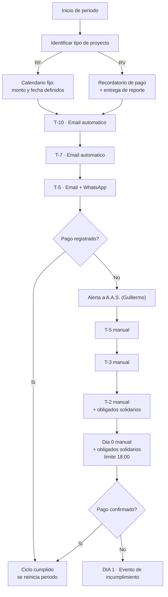
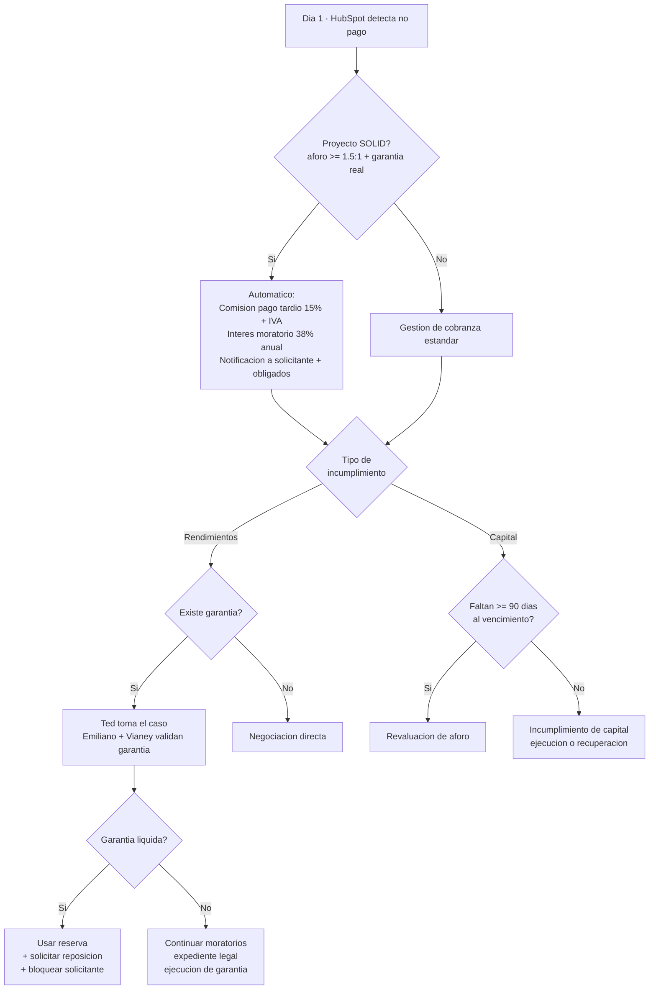

# Proceso de Cobranza

> **En una frase:** de la inversión efectiva a la liquidación (o a la ejecución de la garantía) — el proceso que el cliente declaró como su **máxima prioridad** y el que peor estado técnico tiene.

**Objeto HubSpot:** Ticket · **Pipeline:** Cobranza · **Workflows:** WF-050 a WF-064

**Flujograma TO-BE (V2, 2026-09-01):** `miro.com/app/board/uXjVHsUSSk0=` — tablero en la cuenta de
Miro de B&O, construido desde el V1 del cliente (`miro.com/app/board/uXjVG67KB7Y=`, mar-2026) más las
reglas 21–24 y 29 del contrato de API. Los montos en disputa (moratorio, comisión, aforo) van
marcados como por-confirmar y los alimenta la integración. El V1 queda como histórico; propuesta
pendiente de validación de Monific.

🔴 **El peor bloque del proyecto: 13 de 15 workflows con error, 2 pendientes, 0 verificados.**

---

## La regla estructural

> **Un Ticket de Cobranza por cada campaña fondeada**, asociado al objeto Proyecto y deduplicado por el ID externo de campaña (`id_de_campana_financiamiento`).
> **Admin Monific** calcula calendario, saldos, pagos y mora. **HubSpot** almacena y ejecuta tareas, comunicaciones aprobadas y cambios de etapa.
> **No se crea un objeto Cuota.**

❌ **No existe un objeto personalizado de Cobranza.** Los masters lo describen como "Objeto de Cobranza"; la verificación por API confirmó que en el portal hay **0 objetos personalizados**. La decisión validada el 2026-06-29 es que **cobranza vive en Tickets**. → [[Contradicciones y Verificaciones]]

---

## El pipeline

| Etapa | Objetivo |
|---|---|
| **Nuevo Registro** | Dar de alta la campaña con su calendario de pagos completo, inmediatamente tras confirmarse la inversión efectiva |
| **Cobranza Activa** | Gestionar la campaña sana con recordatorios automáticos y escalar impagos por niveles de mora. **Aquí se sustituye a Moonflow** |
| **Refinanciamiento** | Formalizar la reestructura con un solicitante en mora, con aprobación de comité y trazabilidad para auditoría CNBV |
| **Ejecución de Garantía** | Gestionar mora crítica > 60 días como transición a cierre negativo, con última decisión formal del comité |
| **Cierre por Refinanciamiento** | Cierre positivo: el solicitante cumplió las nuevas condiciones pactadas |
| **Campaña Liquidada** | Cierre exitoso al último pago: actualizar historial, notificar y habilitar al solicitante para nuevas campañas |
| **Cierre por Incumplimiento** | Cierre forzoso: inicio del proceso jurídico, notificación a inversionistas, bloqueo del solicitante |

⚠️ El master de Cobranza distingue *Refinanciamiento* (etapa de gestión) de *Cierre por refinanciamiento* (etapa terminal). Son dos cosas distintas.

---

## El ciclo de cobranza preventiva

**Principio declarado:** *Día 1 = incumplimiento. No hay periodos de gracia.* Si la fecha límite cae en día inhábil, se recorre al siguiente día hábil.

**Regla dura:** sin confirmación explícita en HubSpot antes de las 18:00 del Día 0, **el sistema asume NO pago**.

---

## El evento de incumplimiento

🔴 **Estos números están en disputa. No los configures sin resolverlos:**

| Dato | `D195` (diseño con IA) | Instrucción directa de dirección |
|---|---|---|
| **Interés moratorio** | 38 % anual, solo proyectos Solid | **Vianey Correa, Dir. Finanzas (2026-03-05):** *"para todos los casos **sin excepción y sin casos especiales** es **dos veces la tasa ordinaria**"* |
| **Aforo** | ≥ 1.5 : 1 | **Karen Gómez / Raquel (2026-04-17):** *"idealmente **2:1**"* |
| Comisión por pago tardío | 15 % + IVA | Sin confirmación independiente |

Prevalece la instrucción de dirección; todo debe confirmarse contra el contrato de financiamiento real. → [[Contradicciones y Verificaciones]] C-21 y C-22

---

## La cadena de escalamiento

Aquí hay **dos versiones que conviven** y hay que conciliar:

### Versión A — Maestro Operativo (`D167`), cadena ARI

| Día | Acción |
|---|---|
| **15** | Aviso a **ARI** para preparar la tabla de adeudo |
| **16** | ARI queda copiado en la escalación |
| **30** | ARI inicia cobranza formal junto con Finanzas |
| **61+** | Ejecución legal |

🔴 *"Los workflows actuales no acreditan esta cadena ni la recepción por ARI."*

### Versión B — Correo interno de Cobranza (Miguel Emiliano, fuente F09)

> Semana 1 Monific · Semana 2 despacho · Acción legal desde semana 3.

### Versión C — Flujo de `D195`

Escalamiento por tipo de incumplimiento con SLAs por fase (≤24 h asignación a Ted, ≤48 h validación de garantía, ≤72 h uso de reserva).

❓ Las tres coexisten sin conciliación explícita. El pendiente crítico del Maestro Operativo lo dice: *"Cobranza: dejar explícita la operación semana 1 Monific, semana 2 despacho y acción legal desde semana 3"*. → [[Contradicciones y Verificaciones]]

---

## Los workflows — el bloque más dañado

| WF | Nombre | Estado HubSpot | Estatus |
|---|---|---|---|
| WF-050 | Asignar propietario de cobranza (a Guillermo) | ON | 🔴 |
| WF-051 | Enviar tarea de campaña RV | ON | 🔴 |
| WF-052 | Cambio de etapa a cobranza activa | ON | 🔴 |
| WF-053 | Recordatorios activos | OFF | 🔴 |
| WF-054 | Recordatorios antes del 15 del mes | OFF | 🔴 |
| WF-055 | Recordatorios por vencimiento 15 | OFF | 🔴 |
| WF-056 | Cambio de etapa a liquidado | ON | 🔴 |
| WF-057 | Cambio de etapa a ejecución | ON | 🔴 |
| WF-058 | Propiedades de entrada | ON | 🔴 |
| WF-059 | Mover a cierre por refinanciamiento | ON | 🔴 |
| WF-060 | Mover a cierre por ejecución de garantía | ON | 🔴 |
| WF-061 | Propiedades y notificaciones | ON | 🔴 |
| WF-062 | Propiedades de entrada | ON | 🔴 |
| WF-063 | Propiedades de entrada | ON | 🟡 |
| WF-064 | Propiedades de entrada | ON | 🟡 |

### Los problemas concretos

| Hallazgo | Problema |
|---|---|
| **CON-104** 🔴 | WF-053: la única acción es "Inscribirse en una secuencia" con tokens `{{sequenceId}}` y `{{senderType}}` **sin resolver**. El workflow **no puede ejecutarse**. Tampoco contempla WhatsApp, que la minuta del 2026-03-05 declara obligatorio cuando el solicitante tiene teléfono |
| **CON-109** 🔴 | WF-059: mueve a "Cierre por refinanciamiento" pero **solo cambia la propiedad**. No notifica a Compliance/Dirección/Finanzas, no crea tarea de archivo, no genera el registro CNBV trazable |
| Cobranza preventiva rota 🔴 | WF-053 y WF-054: nodos de secuencia sin `sequenceId`. **El solicitante moroso no recibe recordatorios preventivos** |
| Ejecución sin aviso 🔴 | WF-061: las tres comunicaciones son internas. **Ningún nodo notifica al cliente** sobre la ejecución de su garantía |
| Cierre por incumplimiento 🔴 | WF-064: el cuerpo instruye "activar comunicación externa" pero el workflow **no contiene nodo de envío externo** |
| Tokens rotos 🔴 | `{{enrolled_object.subject/content/monto_total}}` en WF-055, WF-058, WF-061 y WF-064 **no renderizan** |

Bloque de remediación: **B05** (+25 días hábiles). → [[Bloques de Cierre B01-B16]]

---

## Propiedades

Del master (`X011`). ⚠️ Muchas están asignadas a "Objeto de Cobranza", que no existe: deben migrarse a Ticket.

**Alta del registro:** Nombre · Apellido · Correo · Teléfono · RFC Solicitante · ID Solicitante · ID Proyecto · **ID Campaña** (códigos `FIN`/`REFIN`) · Historial de pago · Nombre del proyecto · Tipo de proyecto (RF/RV) · Fecha de inversión efectiva · Fecha de vencimiento · Monto total · Plazo en meses · Fecha primer/último pago · Número de cuotas totales · Tabla completa de cuotas *(las últimas 6 solo aplican a RF)*

**Nuevo Registro:** ID Cobranza · Propietario de campaña · Link de expediente en Drive · Condiciones especiales

**Cobranza Activa:** Días de mora · **Semáforo del proyecto** (Verde/Amarillo/Rojo) · Fecha y monto del último pago registrado · Fecha del último contacto · **Estatus de cobranza** (Al corriente / Mora temprana / Mora moderada / Mora grave / Bloqueado) · Nota de acuerdo de pago *(obligatoria desde Mora Moderada, día 16+)* · Número de intentos de contacto · Razón del retraso · Notas de gestión

**Refinanciamiento:** Fecha de inicio y de aprobación de reestructura · Responsable de aprobación · Motivo · Nota de decisión del comité · Condiciones especiales · Link al contrato

**Ejecución de Garantía:** Fecha de envío a garantía · Estatus del proceso jurídico · Días de mora al ingresar · Número de expediente jurídico · Abogado externo asignado · Monto vencido acumulado · Monto recuperado · Observaciones

**Campaña Liquidada:** Fecha de liquidación · Historial de pago · Estado de crédito final · **Conciliación validada por D.F.** · Calificación del proyecto CNBV · Link del expediente

**Cierre por Incumplimiento:** Fecha de cierre · Monto vencido acumulado · Estatus del proceso jurídico · Número de expediente · Observaciones

🔴 **26 de estas propiedades no existían en HubSpot** al 2026-06-17. Bloque **B07**. → [[Propiedades]]

---

## Las propiedades que llegan por API

Según el contrato técnico (`X018`), el Admin envía al Ticket:

`id_de_campana_financiamiento` (clave canónica) · `id_del_proyecto` · `plaza_meses` · `fecha_primer_pago` · `fecha_ultimo_pago` · `fecha_proximo_pago` · `tabla_cuotas` · `estado_de_pago` (Al corriente / Mora temprana / Mora moderada / Mora grave) · `monto_esperado_pago` · `monto_total_deuda` · `monto_pagado_acumulado` · `saldo_pendiente_mes_corriente` · `monto_deudas_pasadas` · `saldo_insoluto_total` · `total_de_mensualidades` · `mensualidades_restantes`

⚠️ `id_de_campana` es un **campo heredado**: no crear uno nuevo; migrar a `id_de_campana_financiamiento`.

**Regla 29 · Programación de recordatorios:** el backend calcula diariamente días hábiles y actualiza `fecha_proximo_recordatorio`; el workflow nativo se activa en la fecha ya calculada. *Sustituye la lógica de calendario no disponible sin Data Hub.*

→ [[Reglas de Negocio API]]

---

## Eventos del ciclo de vida (reglas 21–24)

| Regla | Evento | Acción |
|---|---|---|
| 21 | Confirmación de la inversión efectiva | Crear Ticket de Cobranza y asociarlo a Contacto, Negocio solicitante y Proyecto. Etapa "Nuevo Registro" |
| 22 | Pago ordinario o parcial conciliado | Actualizar saldos. Permite que HubSpot **detenga la secuencia de recordatorios** al detectar la cuota cubierta |
| 23 | Última cuota y liquidación de capital | Saldos a 0, etapa "Campaña Liquidada", notificaciones de liberación de garantía |
| 24 | Aprobación de refinanciamiento en comité | Mover a "Cierre por Refinanciamiento" y **crear un Ticket nuevo** (ej. `FIN-001-REFIN`). *Un refinanciamiento es la extinción de un ticket y el nacimiento de otro, no un ajuste de plazos* |

---

## Comunicación a inversionistas ante incumplimiento

Responsable: **[[Raquel Alfie]]**

| Situación | Mensaje |
|---|---|
| Hubo garantía líquida | *"Hubo un retraso operativo. Se activó la garantía líquida. Tu rendimiento se pagará puntualmente."* |
| No hubo garantía líquida | *"Se activó el proceso de cobranza con respaldo patrimonial. El crédito cuenta con aforo ≥ 1.5 : 1."* |

### Guidelines de tono en cobranza

| Sí decir | No decir |
|---|---|
| "Conforme a contrato" | "Te entendemos" |
| "Se activó automáticamente" | "Vamos viendo" |
| "Para evitar mayores consecuencias" | "No pasa nada" |

---

## Relacionado

- [[Proceso Comercial Solicitantes]] — de dónde viene el ticket
- [[SLAs y Escalamientos]] — los tiempos por fase
- [[Roles Operativos]] — ARI y el A.A.S.
- [[Matriz de Comunicaciones]] — las 33 comunicaciones COB
- [[Workflows]] · [[Pipelines]] · [[Propiedades]]
- [[Reglas de Negocio API]]

## Fuentes

- `D167` — Maestro Operativo (2026-07-31): fichas WF-050 a WF-064, cadena ARI
- `X011` — Master de Implementación Cobranza: pipeline, workflows y propiedades
- `D195` — Entregables del 26 de enero: flujo completo, SLAs, penalizaciones
- `X018` — Documento API: reglas 21–24 y 29
- `D174` — Minuta 2026-05-15: presentación del pipeline
- `D180` — Minuta 2026-07-27: Admin como fuente de verdad, 60 días → ejecución
- `X020` — Requerimiento Formal: CON-104, CON-109, bloque B05
- `X021` — Auditoría de comunicaciones
