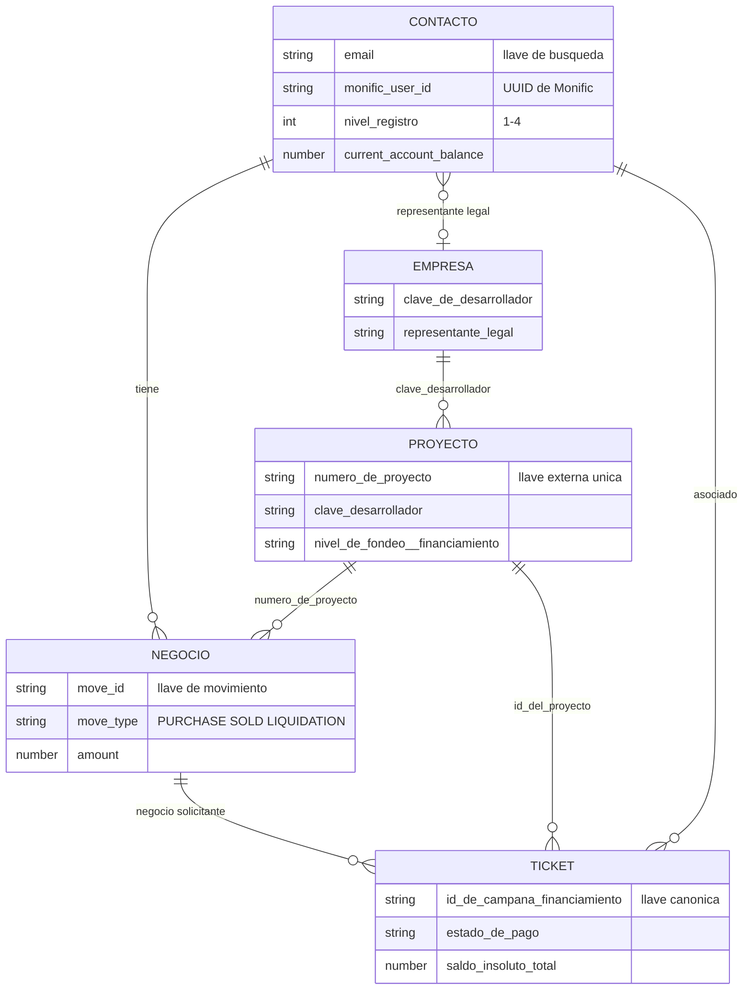

# Modelo de Datos HubSpot

> **En una frase:** cinco objetos y una regla de oro — el objeto **Proyecto** es el conector de todo, y no existe ningún "Deal padre de campaña".

---

## El modelo



---

## Los cinco objetos

| Objeto | Tipo | Uso | Estado en la integración |
|---|---|---|---|
| **Contacto** | Estándar | Personas: inversionistas, solicitantes, representantes legales. Saldos y métricas de cuenta | Existente |
| **Empresa** | Estándar | Información corporativa del desarrollador. Sincronización del representante legal | Existente |
| **Negocio** | Estándar | Proceso comercial de Solicitantes e Inversionistas, y cada movimiento de inversión | Existente — *"se recomienda conservar estructura y datos actuales"* |
| **Ticket** | Estándar | Cobranza (uno por campaña), Atención y UNE | **Nuevo en la integración** |
| **Proyecto (Projects)** | **Estándar de HubSpot**, activado recientemente | Entidad central de conexión y recordatorios | **Nuevo en la integración** |

❌ **No hay objetos personalizados.** La verificación por API del 2026-06-17 confirmó **0 custom objects** en el portal.

---

## La regla de oro

> **Admin/app calcula datos financieros. HubSpot almacena, orquesta y deja trazabilidad.**

HubSpot **no** inventa montos, no calcula saldos, no calcula fechas ni días hábiles. Todo llega resuelto por API.

---

## Las llaves de negocio

| Llave | Objeto | Para qué |
|---|---|---|
| `email` | Contacto | **Llave de localización** del contacto en toda la integración |
| `monific_user_id` | Contacto | UUID único de Monific. Un onboarding por usuario |
| `clave_de_desarrollador` | Empresa / Proyecto | Asociar Proyecto ↔ Empresa desarrolladora |
| **`numero_de_proyecto`** | Proyecto / Negocio | **Clave externa única del Proyecto.** Deduplicación y asociación |
| `move_id` | Negocio | Identifica cada movimiento de inversión. Clave de deduplicación e idempotencia |
| **`id_de_campana_financiamiento`** | Ticket | **Clave canónica del Ticket de Cobranza.** ⚠️ `id_de_campana` es campo heredado: migrar, no crear uno nuevo |

---

## Cardinalidades que hay que entender

```
Empresa (desarrollador)
 └── 1:N Proyecto  (via clave_desarrollador)
        ├── 1:N Campaña ──► 1:1 Ticket de Cobranza  (via id_de_campana_financiamiento)
        ├── 1:1 Negocio de Solicitante              (via numero_de_proyecto)
        └── 1:N Negocio de Inversionista            (via numero_de_proyecto, uno por move_id)

Contacto (persona)
 ├── 1:1 Negocio de onboarding  (INV-04: uno solo por monific_user_id)
 └── 1:N Negocio de movimiento  (uno por PURCHASE / SOLD / LIQUIDATION)
```

**Reglas asociadas (INV-06):**

- Una persona = **un** Contacto
- Una relación = **un** onboarding
- Cada PURCHASE / SOLD / LIQUIDATION = **un movimiento separado** por `move_id`
- **Proyecto conecta.** No existe Deal padre de campaña

**Regla de roles:** *"Monific estipula que un usuario solo tiene un rol: o es inversionista o representante legal, nunca ambos."*

---

## Las asociaciones que hay que crear

| Asociación | Llave | Regla | Estado |
|---|---|---|---|
| Proyecto ↔ Negocio solicitante | `numero_de_proyecto` | Regla 26 | 🔴 Pendiente |
| Proyecto ↔ Negocio inversionista | `numero_de_proyecto` (**no por nombre**) | Regla 27 | 🔴 Pendiente |
| Proyecto ↔ Empresa | `clave_desarrollador` | Regla 28 | 🔴 Pendiente |
| Ticket ↔ Contacto, Negocio y Proyecto | `id_de_campana_financiamiento` + `id_del_proyecto` | Regla 21 | 🔴 Pendiente |
| Empresa ↔ Contacto (representante legal) | `companyToContact` | Regla 12 | 🔴 Falta el **association label** "Representante Legal" — bloque B11 |

⚠️ La regla 27 dice literalmente *"se asocia un proyecto al negocio por medio del `nombre_de_proyecto`"* en la columna de condición, pero la decisión final aclara *"No asociar por nombre; usar identificador estable"*. Prevalece `numero_de_proyecto`. → [[Contradicciones y Verificaciones]]

---

## Pipelines y etapas conocidas

| Pipeline | ID | Etapas con ID conocido |
|---|---|---|
| **Inversiones** | `708176204` | Inversión activa `1035451748` · Venta `1059885878` · Liquidación `1319443839` |
| **Default** | — | Mercado secundario / campaña `1056454416` |
| Solicitantes | — | 6 etapas, IDs pendientes (gate T3) |
| Cobranza | — | 7 etapas, IDs pendientes |
| Atención | — | 4 etapas, IDs pendientes |
| UNE | — | 2 etapas, IDs pendientes |

🔴 Hay **5 pipelines de Negocio** en el portal. El plan de corrección (PLAN-036) pide consolidar a un pipeline único de Mercado Primario y archivar el "Pipeline Inversionistas" (vacío) y los redundantes.

→ [[Pipelines]]

---

## La decisión sobre el objeto de Cobranza

❓ **Contradicción resuelta pero no propagada:**

| Fuente | Dice |
|---|---|
| Master de Cobranza (`X011`) | Las propiedades pertenecen a un **"Objeto de Cobranza"** y a un **"Objeto Edificio / Proyecto"** |
| API (2026-06-17) | **0 objetos personalizados** en el portal |
| Reunión 2026-06-29 (`D178`) | *"El objeto de cobranza se sustituyó por el objeto de tickets, donde se lleva ese tracking"* — validado por Raquel |
| Maestro Operativo (`D167`) | *"Ticket por campaña asociado a Proyecto. **No se crea objeto Cuota**"* |

**Decisión vigente: Cobranza vive en Tickets.** El master aún no refleja esto — es parte del bloque **B01** (conciliación master ↔ HubSpot).

→ [[Contradicciones y Verificaciones]] · [[Proceso de Cobranza]]

---

## Dirección del flujo

**Fase inicial: unidireccional Admin Monific → HubSpot** (decisión D-02 del 2026-08-04).

Excepciones (HubSpot → Monific):

- `hs_object_id` del Proyecto: HubSpot lo genera y Monific lo guarda como referencia
- `hs_createdate` del Proyecto: HubSpot registra la fecha de creación

No se contempla, por ahora, que HubSpot actualice el Admin de Monific.

→ [[Integracion Admin Monific HubSpot]]

---

## Relacionado

- [[Reglas de Negocio API]] — las 30 reglas de sincronización
- [[Diccionario de Propiedades API]] — el mapeo campo a campo
- [[Pipelines]] · [[Propiedades]]
- [[Proceso de Cobranza]] — por qué el Ticket es por campaña

## Fuentes

- `D167` — Maestro Operativo: modelo de objetos y decisiones INV-06, INV-13
- `X018` — Documento API de Integración Unificado: reglas 20–30 y mapeo
- `D181` — Minuta 2026-08-04: objetos y dirección del flujo
- `D180` — Minuta 2026-07-27: confirmación del objeto Proyecto
- `X002` — Matriz de Hallazgos: verificación de custom objects
- `D178` — Minuta 2026-06-29: sustitución del objeto de Cobranza por Tickets
