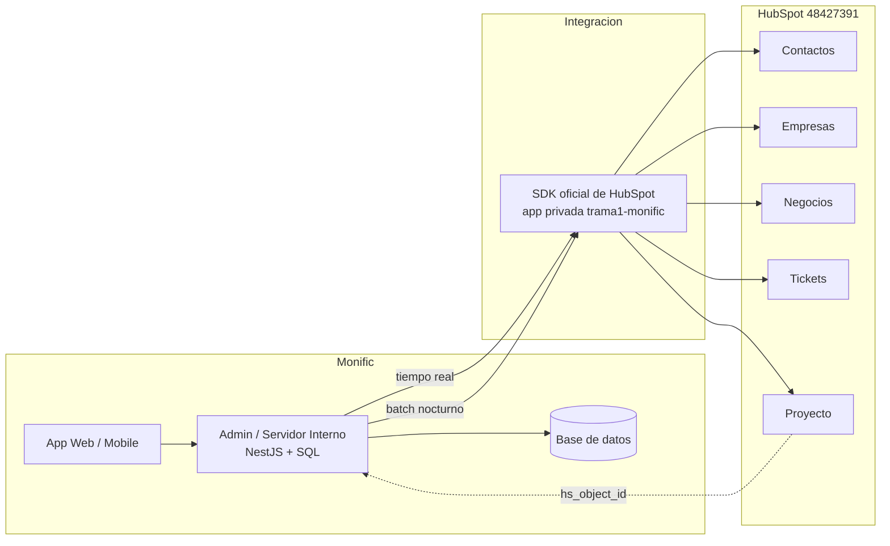

# Integración Admin Monific ↔ HubSpot

> **En una frase:** el puente unidireccional Admin Monific → HubSpot, la pieza que ha bloqueado el proyecto desde mayo y que apenas arrancó formalmente el 2026-08-04.

**Mapa visual (V2, 2026-09-01):** `miro.com/app/board/uXjVHr71ouw=` — tablero en la cuenta de Miro
de B&O: arquitectura, modos de sincronización, robustez, gate T1–T7 y cómo la API alimenta cada uno
de los cuatro flujogramas V2.

---

## La arquitectura

| Aspecto | Detalle |
|---|---|
| **Dirección** | **Unidireccional** Admin → HubSpot en la fase inicial (decisión D-02) |
| **Excepciones** | HubSpot → Monific solo para `hs_object_id` y `hs_createdate` del Proyecto |
| **Cliente** | SDK oficial de HubSpot en el repositorio de Monific. **No** es plugin ni conector de terceros |
| **Backend** | NestJS · base SQL · GitHub |
| **Ambientes** | Pruebas, QA y PRE (homologado de producción) |
| **App privada** | `trama1-monific` (ID `10092461`) |
| **Quién desarrolla** | **TI de Monific** ([[Jesus Torres]] y Daniel Torres). B&O da especificación y soporte |

---

## La regla de oro

> **Admin/app calcula datos financieros. HubSpot almacena, orquesta y deja trazabilidad.**
>
> La lógica, validación, deduplicación y reintentos **ocurren en Monific**; HubSpot recibe datos finales.

Consecuencia directa de que la suscripción no incluye entorno de código ni Data Hub. → [[Portal HubSpot]]

---

## Modos de ejecución

| Modo | Cuándo | Ejemplos |
|---|---|---|
| **Tiempo real** | Eventos del ciclo de vida del usuario | Creación de contacto, avance de nivel de registro, alta de Ticket de Cobranza, registro de pago |
| **Batch nocturno** | Datos que cambian de forma continua | 01:00 saldo disponible · 02:00 dinero invertido · 03:00 valor de cuenta y ganado actual · 12:00 AM movimientos de inversión |
| **Batch manual o programado** | Sincronizaciones de catálogo | Empresas, representantes legales, proyectos de fondeo |
| **Reconciliación (fallback)** | Red de seguridad | `POST /hubspot/investors/deals/sync` reprocesa lo que falló en tiempo real |

⚠️ El horario de 01:00 es **propuesta de B&O**, sujeta a validación técnica de Monific (acción A-06 del 2026-08-04). Objetivo: evitar saturación de llamadas API.

---

## Endpoints conocidos

| Endpoint | Qué hace |
|---|---|
| `POST /hubspot/developers/companies/sync` | Crear/actualizar Empresa desarrolladora |
| `POST /hubspot/developers/contacts/sync` | Sincronizar representante legal y asociarlo a la Empresa |
| `POST /hubspot/developers/deals/sync` | Sincronizar Proyectos de fondeo |
| `POST /hubspot/investors/deals/sync` | Reconciliación batch de inversiones (fallback) |

---

## Mecanismos de robustez

| Mecanismo | Cómo funciona |
|---|---|
| **Idempotencia** | Claves externas: `move_id`, `numero_de_proyecto`, `id_campana`. Crear o actualizar sin duplicar |
| **Hash MD5** | Si los datos son idénticos al último envío, se hace **SKIP** |
| **Tolerancia a fallos** | *"Si HubSpot falla, el registro en la app Monific continúa."* El error se registra en el log del servidor |
| **Reintentos** | Fallos de API se reintentan en el siguiente batch |
| **Reconciliación** | El batch de fallback detecta y corrige discrepancias, marcando `dedup=true` |
| **Trazabilidad** | `monific_last_synced_at` en cada sincronización — útil también como evidencia de frecuencia real ante CNBV |
| **`technical_source`** | Se envía siempre como `"batch"` por código en los deals de inversión |

---

## Historia: por qué tardó tanto

| Fecha | Hito |
|---|---|
| 2026-03-02 | Primera sesión de alineación técnica |
| 2026-03-11 | Mapeo de propiedades para la integración |
| **2026-03-09** | ⭐ **TI de Monific arregla la sincronización existente.** Registro, compra y venta de participaciones ya reportan correctamente a HubSpot. Resincronización de solicitantes, contactos, compras y liquidaciones con **corte al 8 de marzo**. Se entrega el *Documento 1.0 de integración técnica* |
| 2026-05-04 / 05-06 | Previa y validación final de campos |
| **2026-05-07** | B&O pide accesos para Jazmín: GitHub `@BNO-Proyectos` y entornos dev/QA/preproducción. **Pausa formal del frente API del 7 al 22 de mayo** por revisión interna de Monific con Gobierno |
| **2026-05-08** | 🔴 **Monific niega el acceso al repositorio:** *"contiene información sensible de la plataforma"*. Ofrece sesión de revisión de código con Jesús compartiendo pantalla |
| **2026-05-22** | 🔴 Se reconoce el retraso: falta de documentación de la API. Estimación de 12 semanas adicionales |
| **2026-05-27** | 🔴🔴 **Consta en minuta: *"La integración sigue bloqueada por auditoría de la CNBV. Monific debe certificar el acceso a terceros antes de otorgarlo; el proceso está en manos del equipo legal."*** Pendientes: Raquel comunica la urgencia a Emiliano; Eduardo gestiona la documentación legal para acceso de terceros |
| **2026-06-08** | 🔴 **B&O abandona la integración directa** y pasa a modelo de **asesoría técnica**: orienta pero no manipula el código — consecuencia directa del bloqueo anterior |
| **2026-06-09** | Raquel formaliza el modelo: *"B&O capacita y guía a nuestro equipo de TI; Monific conserva el control de accesos, repositorios, despliegues, ejecución técnica y trazabilidad interna"*. Propone un **anexo operativo breve** sujeto a revisión legal de ambas partes |
| **2026-06-16** | Sesión de transición e integración con Jesús y Daniel |
| **2026-06-29** | Se registra que por restricciones del banco y del manejo de la bolsa, B&O **no puede ejecutar la conexión directa** |
| **2026-07-27** | Se confirma el objeto Proyecto como conector y el Admin como fuente de verdad de cobranza |
| **2026-08-04** | **Primera sesión formal con TI**: se entrega el documento maestro de propiedades y reglas |

→ [[Cronologia del Proyecto]] · [[Correspondencia]]

### ⚠️ Matiz importante: sí hubo integración funcionando

La narrativa de "la integración nunca funcionó" es imprecisa. **Desde el 2026-03-09 existe una integración operativa** que sincroniza registro, compra y venta de participaciones, construida y arreglada por TI de Monific, con una resincronización histórica al 8 de marzo.

Lo que está pendiente es la **ampliación**: incorporar los objetos **Ticket** y **Proyecto**, las propiedades financieras de Contacto (`current_account_balance`, `invested_balance`, `account_value`, `current_profit`) y las 30 reglas del contrato técnico.

→ [[Contradicciones y Verificaciones]] C-26

### ⚠️ La causa raíz del bloqueo, en una línea

**B&O nunca tuvo acceso al código porque una auditoría de la CNBV obligaba a Monific a certificar el acceso a terceros antes de otorgarlo.** No fue desidia del proveedor ni negativa arbitraria del cliente: fue una restricción regulatoria. → [[Conflicto Contractual]] · [[Riesgos]]

---

## Lo acordado el 2026-08-04

| ID | Decisión | Estado |
|---|---|---|
| **D-01** | Mantener Contactos, Empresas y Negocios; incorporar **Tickets y Projects** | Acordado |
| **D-02** | Flujo **unidireccional** Admin → HubSpot en la fase inicial | Acordado |
| **D-03** | El documento maestro es la fuente de referencia de propiedades y reglas | Acordado |
| **D-04** | Validar propiedades existentes y detectar duplicados antes de crear o modificar | Pendiente de ejecución |
| **D-05** | Conservar el modelo de Negocios ya implementado salvo necesidad técnica comprobada | Acordado |
| **D-06** | Resolver **externamente** la lógica avanzada que HubSpot no puede ejecutar | Acordado |
| **D-07** | Canalizar bloqueos por medio de Raquel; convocar sesión especializada con Ricardo/Jazmín cuando aplique | Acordado |
| **D-08** | Evaluar reuniones recurrentes breves de seguimiento (15–20 min) | Frecuencia por confirmar |

### Plan de acción abierto

| ID | Responsable | Actividad | Estado |
|---|---|---|---|
| A-01 | Raquel | Compartir el enlace del documento maestro con Daniel y Jesús | Pendiente |
| A-02 | Daniel y Jesús | Revisar el mapeo y confirmar que cada propiedad exista en el Admin, aunque use otra nomenclatura | Pendiente |
| A-03 | Equipo Monific | Identificar propiedades repetidas y definir la fuente válida | Pendiente |
| A-04 | Equipo Monific | Iniciar la implementación de objetos, IDs, asociaciones y reglas | Pendiente |
| A-05 | Ricardo y Jazmín (B&O) | Atender dudas técnicas y desbloquear | Disponible |
| A-06 | Ambos | Validar horario y periodicidad de las sincronizaciones masivas | Pendiente |
| A-07 | Raquel con Daniel y Jesús | Definir sesiones recurrentes de 15–20 min | Pendiente |
| A-08 | Ambos | Mantener actualizaciones en el canal acordado | En curso |

---

## El gate técnico T1–T7

Antes de programar endpoints definitivos hay que cerrar siete puntos. Nacieron de un correo de Daniel Torres pidiendo diccionario, payloads, IDs, modelo, inconsistencias, aceptación y evidencia.

| ID | Qué |
|---|---|
| **T1** | Diccionario canónico: etiqueta, internal name, objeto, tipo, opciones internas, fuente y obligación |
| **T2** | Payload por evento: request, response, formato, nullability, zona horaria y ejemplo realista |
| **T3** | IDs reales: `objectTypeId`, `pipelineId`, `stageId`, `associationTypeId`/labels y registros de prueba |
| **T4** | Inconsistencias corregidas: Deal de campaña vs. Proyecto, nombres, catálogos, estados y asociaciones |
| **T5** | Modelo confirmado: fuente de verdad, altas, actualizaciones, cardinalidad, deduplicación y huérfanos |
| **T6** | Casos de aceptación: positivo, negativo, duplicado, retry, reingreso, asociación, huérfano y catálogo |
| **T7** | Evidencia HubSpot: URL/ID, export y prueba — no basta captura de existencia |

🔴 **Ninguno está cerrado.** El bloque **B10** exige entregarlos: *"Documentar niveles, mapeo financiero, Deal padre, Mercado Secundario, catálogo y asociaciones. ADR, diccionario, payloads, eventos y casos límite. Criterio: TI puede implementar sin reabrir discovery ni adivinar reglas."* Plazo: +15 días hábiles.

---

## 🔴 Los problemas conocidos de la integración en producción

Log del 2026-06-30 al 2026-07-29:

| Métrica | Valor |
|---|---|
| Llamadas | 16,279 |
| Errores 4xx | 766 |
| Rechazos | 741, concentrados en **valores de proyecto no admitidos** |

| Problema | Causa | Corrección |
|---|---|---|
| `POST /deals` → 400 | `nombre_de_proyecto` enviado como etiqueta, con inconsistencias UTF-8 en 172 opciones | Enviar `internalValue` en todos los dropdowns; normalizar catálogo; reprocesar ~1,125 deals |
| `POST /contacts` → 409 | Duplicados | Implementar **upsert por email** |
| `POST .../groups` recurrente | Crea grupos de propiedades en cada corrida | Hacerlo idempotente |
| Búsqueda de empresas falla | Filtro `name` con valor vacío | Validar antes de armar el body |

→ [[Higiene y Accesos]]

---

## Riesgos declarados (2026-08-04)

| Riesgo | Prob. | Impacto | Control |
|---|---|---|---|
| Nombres internos o valores dropdown distintos entre sistemas | Media | Alto | Validar matriz de equivalencias antes del desarrollo; congelar identificadores aprobados |
| **Propiedades duplicadas o históricas con usos distintos** | **Alta** | Alto | Inventario, propietario de dato y regla de consolidación antes de sincronizar |
| Asociaciones incorrectas por IDs de proyecto, campaña o ticket | Media | Alto | Definir llaves únicas, pruebas de asociación y validaciones de existencia |
| Carga excesiva o límites de API | Media | Medio/Alto | Lotes, horario de baja demanda, reintentos y log |
| **Ausencia de entorno de código en HubSpot** | **Confirmada** | Alto | Lógica externa con monitoreo, trazabilidad y manejo de credenciales |
| Reglas comerciales no comprendidas por desarrollo | Media | Alto | Compartir videos/diagramas y hacer sesión funcional |
| Falta de cadencia de seguimiento | Media | Medio | Reunión corta recurrente y canal único de bloqueos |

---

## Relacionado

- [[Reglas de Negocio API]] — las 30 reglas de sincronización
- [[Diccionario de Propiedades API]] — el mapeo campo a campo
- [[Modelo de Datos HubSpot]] — objetos, llaves y asociaciones
- [[Sistemas Externos]] · [[Jesus Torres]]
- [[Plan de Cierre y Gantt]] — la fase F4

## Fuentes

- `X018` — Documento API de Integración Unificado (el contrato técnico)
- `D181` — Minuta 2026-08-04: decisiones D-01 a D-08, plan A-01 a A-08, riesgos
- `D180` — Minuta 2026-07-27
- `D167` — Maestro Operativo: gate T1–T7, fuentes F07 y F08
- `D133` — Alineación interna 2026-06-08: cambio a modelo de asesoría
- `D177`, `D178` — Minutas 2026-06-16 y 2026-06-29
- `X020` — Requerimiento Formal: bloque B10
