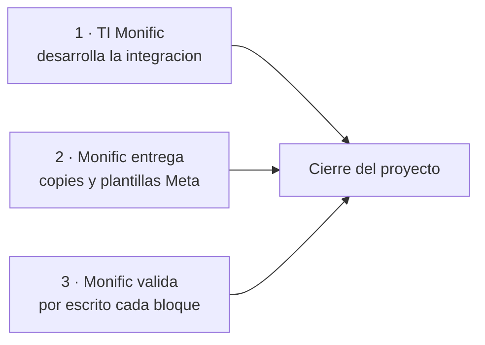

# Estado Actual

> **En una frase:** al 2026-08-31 el proyecto sigue en remediación y con la fecha de cierre vencida, pero tres bloques que estaban en cero —comunicaciones, masters depurados y dashboards— cambiaron de estado según lo declarado por Dirección de B&O, **sin acreditar todavía con evidencia**.

**Corte documental más reciente:** 2026-08-03 (`D198`) · **Corte técnico por API:** 2026-06-17 · **Corte declarativo:** 2026-08-31 (`V_DO_20260831`)

⚠️ **Cómo leer esta página.** Las filas marcadas 🔵 son **declaraciones de Dirección de B&O sin evidencia cargada**. El criterio del proyecto es explícito —*configurado ≠ verificado*— y el requerimiento exige URL/ID + export fechado + caso de prueba + validación escrita de Monific. Hasta que eso exista, una declaración **no cierra un bloque**; solo cambia lo que hay que probar. → [[Bloques de Cierre B01-B16]]

---

## Semáforo global

| Bloque | Estado | Nota |
|---|---|---|
| Mapeo y documentación (masters, flujogramas) | 🟡 | Entregados y homologados en julio; pendiente conciliar con el estado real de HubSpot (B01) |
| Pipelines | 🟡 | Los 5 existen. Hay 5 pipelines de Negocio que consolidar |
| Workflows | 🔴 | 70 flujos: **0 verificados**, 41 pendientes, 29 con error |
| Propiedades | 🔴 | 26 de 31 comprometidas no existen. 383 propiedades vacías |
| Comunicaciones | 🔵 | **Publicadas e integradas en HubSpot** según declaración del 2026-08-31. Falta cargar link + trigger + destinatario + prueba por asset (B08) |
| Dashboards | 🔵🔴 | **Bloqueados por la integración** según declaración del 2026-08-31 — pero solo 2 de los 4 dependen de ella. Ver abajo |
| Integración Admin → HubSpot | 🟡 | Arrancó formalmente el 2026-08-04. Sin confirmación de H3 en fuentes |
| Capacitación y base de conocimiento | 🔴 | 2 sesiones impartidas. Materiales **construidos y publicados** (Repaso, Mapa, base de conocimiento); falta acreditar entrega, asistencia y evaluación (B09) |
| UNE | 🔴 | 6 flujos sin acreditar. Riesgo regulatorio |
| Higiene y accesos | 🔴 | App legacy activa, scopes excesivos, destinatarios de B&O en producción |
| Masters con contenido de otro cliente | 🔵 | **Depurados** según declaración del 2026-08-31. Falta el control de cambios y la aceptación escrita (B12) |

---

## Las cifras que importan

### Workflows (corte 2026-07-31)

| Universo | Total | ✅ | 🟡 | 🔴 |
|---|---|---|---|---|
| Solicitantes | 24 | 0 | 17 | 7 |
| Inversionistas | 16 | 0 | 13 | 3 |
| Servicio | 9 | 0 | 9 | 0 |
| Cobranza | 15 | 0 | 2 | 13 |
| UNE | 6 | 0 | 0 | 6 |
| **TOTAL** | **70** | **0** | **41** | **29** |

### Estado real por API (2026-06-17)

| Indicador | Valor |
|---|---|
| Workflows en el portal | 96 · 57 ON · 39 OFF |
| Workflows que comunican al cliente | **9 de 96 (9 %)** |
| Propiedades comprometidas creadas | **5 de 31 (16 %)** |
| Objetos personalizados | 0 |
| Nodos de workflow auditados | 4,848 |
| Propiedades totales en el portal | 2,142 |

### Comunicaciones

| Corte | Existen | Publicadas |
|---|---|---|
| 2026-06-16 | 43 nodos AS-IS | **0 de 81** |
| 2026-07-08 | 46 correos | **0** — todos en borrador |
| 2026-07-28 | 56 assets | **0** |
| 2026-08-31 (declarado) | — | 🔵 **81 publicadas e integradas** — sin inventario de assets ni evidencia cargada |

### Hallazgos (corte 2026-06-18)

| Concepto | Valor |
|---|---|
| Consolidados | 284 |
| Abiertos | 251 |
| **Exigibles a B&O** | **217** — 84 críticos · 87 altos · 37 medios · 9 bajos |
| Reconocidos por escrito por B&O | 103 |
| Resueltos / validados | 18 |
| Acciones de TI de Monific cerradas | 12 de 20 |

---

## Qué sí está hecho

Para dar la foto completa, no solo lo que falta:

| Logro | Evidencia |
|---|---|
| **Los cinco procesos mapeados AS-IS y TO-BE** | 4 masters de implementación + 6 flujogramas |
| **Los cinco pipelines construidos** con sus etapas | Verificado en el portal |
| **64 workflows numerados existen** en HubSpot y 57 están encendidos | Inventario por API |
| **56 assets de comunicación creados** (aunque en borrador) | Verificación 2026-07-28 |
| **Contrato técnico de integración documentado** | `X018`: mapeo de propiedades + 30 reglas de negocio |
| **Decisiones canónicas cerradas** | Viabilidad sin scoring, objeto Proyecto, cobranza en Tickets, INV-01 a INV-14 |
| **Objeto Proyecto activado** en el portal | Confirmado 2026-08-04 |
| **Dos sesiones de capacitación de Ventas** impartidas | 2026-06-04 y 2026-06-05 |
| **Auditoría técnica completa** con evidencia por API | 4,848 nodos y 2,142 propiedades revisados |
| **Plan de remediación con hitos** | Gantt v2 (2026-07-16) |
| **Integración arrancada del lado de TI** | Sesión 2026-08-04 |

---

## Los avances de los últimos 30 días

| Fecha | Avance |
|---|---|
| 2026-07-16 | Gantt v2 de remediación, con Emmanuel Chulin como responsable |
| 2026-07-27 | Se cierran tres decisiones que estaban bloqueando: viabilidad sin scoring, objeto Proyecto como conector, Admin como fuente de verdad de cobranza |
| 2026-07-28 | Verificación en vivo del estado de las 81 comunicaciones |
| 2026-07-30/31 | Monific revisa los masters homologados y entrega comentarios |
| 2026-07-31 | Se publica el **Maestro Operativo**, primer documento que consolida todo en una sola fuente |
| 2026-08-03 | B&O entrega su **análisis de cierre**: clasifica los 70 pendientes por naturaleza y acota a **~10 los defectos de configuración propios** de los 29 rojos. Compromete 11 correcciones y lleva 12 puntos a decisión |
| 2026-08-04 | Primera sesión técnica real con TI: se acuerda modelo unidireccional, objetos nuevos y sincronización nocturna |
| 2026-08-31 | 🔵 Dirección de B&O declara **comunicaciones publicadas e integradas** y **masters depurados**. Sin evidencia cargada. Ver la sección de actualización declarada |

**Lectura:** el proyecto se desbloqueó a nivel de decisiones en julio. Lo que falta ahora es **ejecución con evidencia**.

⚠️ **La cifra que cambia la conversación:** de los 29 rojos, B&O sostiene que ~10 son defectos propios; 15 están bloqueados por definición de Monific y 12 son construcción nueva fuera del alcance original. Es una postura **sin validar por el cliente** al 2026-08-11. → [[Analisis de Cierre BNO]]

---

## Actualización declarada — 2026-08-31

Declaración de **David Ochoa** (Dirección B&O) en sesión de revisión. Fuente `V_DO_20260831`. **No hay documento, export ni URL asociados**, así que se registra como declaración y no como acreditación.

| Qué se declaró | Bloque | Qué falta para que cuente como cerrado |
|---|---|---|
| Las **81 comunicaciones ya se publicaron e integraron** en HubSpot | B08 | Link por asset, trigger, destinatario, prueba de envío y **aprobación escrita de Monific**. Criterio: *81 implementadas, cero no iniciadas, aprobadas por Monific* |
| Los **masters ya se depuraron** del contenido de otro cliente | B12 | Explicación del origen, masters versionados con control de cambios y **aceptación escrita**. Criterio: *cero contenido de terceros* |
| Los **dashboards están bloqueados** por la integración | B06 | Ver el matiz de abajo — solo 2 de los 4 dependen de la integración |

### El matiz de los dashboards

B06 pide **cuatro** dashboards: inversión, cobranza, comunicación y desempeño.

| Dashboard | ¿Depende de la integración? |
|---|---|
| Inversión | ✅ Sí — necesita montos, fechas y niveles reales del Admin |
| Cobranza | ✅ Sí — el Admin es fuente de verdad de cobranza (decisión del 2026-07-27) |
| **Comunicación** | ❌ No. Y con las 81 comunicaciones publicadas, ahora es construible |
| **Desempeño** | ❌ No — se alimenta de actividad nativa del portal |

⚠️ **Riesgo de argumentación.** Si B06 se reporta completo como *"bloqueado por el cliente"* y Monific observa que dos de los cuatro no dependían de la integración, se debilita la dependencia declarada en los otros dos —que sí es real. Conviene entregar comunicación y desempeño, y dejar por escrito que inversión y cobranza esperan a H3.

### Efecto colateral sobre B16

Si las comunicaciones se publicaron, es probable que los **tokens HubL sin resolver** de WF-010, WF-055, WF-058, WF-061 y WF-064 se hayan corregido de paso. **No está verificado.** El criterio de B16 es *cero tokens sin resolver*, y se acredita con búsqueda de cero coincidencias y prueba de render. → [[Higiene y Accesos]]

---

## Los hitos en riesgo

| Hito | Fecha plan | Riesgo |
|---|---|---|
| H2 · Definiciones de comunicación de Monific | 2026-07-31 | 🟡 Sin evidencia de entrega formal, pero las comunicaciones se declaran publicadas — lo que implica que el copy llegó por alguna vía |
| HB · Cierre del alcance directo B&O | 2026-08-07 | 🔴 Sin evidencia |
| H3 · Integración TI confirmada | 2026-08-12 | 🔴 **Vencido.** Sin confirmación en fuentes |
| H4 · Activación de Inversionistas | 2026-08-24 | 🔴 **Vencido.** Depende de H3 |
| H5 · Cierre formal | 2026-08-28 | 🔴 **VENCIDO al 2026-08-31.** Sin cierre declarado y **sin prórroga escrita** |

⚠️ **El hito vencido sin prórroga es el hecho más delicado de esta página.** El requerimiento del 2026-06-18 dejó vivo el aviso de rescisión a 30 días y la reclamación de daños directos comprobables. Un calendario propio incumplido sin acuerdo escrito de extensión es precisamente el disparador que R-01 describe. → [[Riesgos]] · [[Conflicto Contractual]]

→ [[Plan de Cierre y Gantt]]

---

## Las tres dependencias que gobiernan el cierre

1. **TI de Monific desarrolla la integración.** B&O solo especifica y da soporte desde el cambio de modelo del 2026-06-08. Es la ruta crítica y B&O no la controla.
2. **Monific entrega copies aprobados y crea las plantillas de WhatsApp en Meta.** El copy está excluido del alcance de B&O y el acceso a Meta también.
3. **Monific valida por escrito.** Ningún punto se cierra sin esa validación, por criterio contractual explícito.

⚠️ Las tres son dependencias **del cliente**, lo cual es simultáneamente el mejor argumento de B&O y el mayor riesgo de calendario.

---

## Qué pasaría si se cerrara hoy

No podría cerrarse. El criterio del requerimiento es explícito:

> *"El proyecto no se considera cerrado mientras existan pendientes críticos o altos abiertos"* — hoy son **171** (84 + 87).
> *"…ni mientras subsista el riesgo operativo y regulatorio asociado a los flujos de atención a usuarios, sujeto a validación de Legal y Compliance."* — UNE sigue sin acreditar.

---

## Relacionado

- [[Pendientes Criticos]] — el detalle de lo que bloquea
- [[Bloques de Cierre B01-B16]] — el plan exigido
- [[Riesgos]] · [[Preguntas Abiertas]]
- [[Plan de Cierre y Gantt]] · [[Conflicto Contractual]]
- [[Auditorias]] — de dónde salen las cifras
- [[Analisis de Cierre BNO]] — la lectura de B&O sobre esas mismas cifras

## Fuentes

- `D167` — Maestro Operativo (2026-07-31): resultado del corte por universo
- `X002` — Matriz Única de Hallazgos: tablero y verificación por API
- `X020` — Requerimiento Formal: cifras oficiales
- `X024` — Gantt v2 (2026-07-16)
- `D180` — Minuta 2026-07-27 · `D181` — Minuta 2026-08-04
- `X007` — Matriz de comunicación vs. HubSpot (2026-07-28)
- `D198` — Historial y contexto de cierre (2026-08-03): clasificación de los 70 pendientes por naturaleza
- `V_DO_20260831` — Declaración verbal de David Ochoa (Dirección B&O) en sesión del 2026-08-31: comunicaciones publicadas e integradas, masters depurados, dashboards bloqueados por integración. **Sin documento de respaldo**
